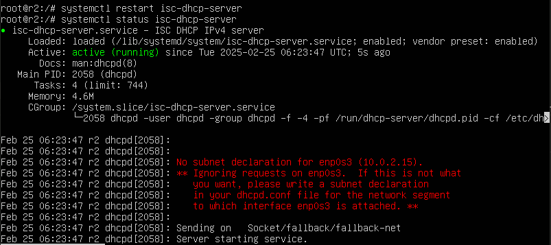

# Отчёт задания DO2_LinuxNetwork  


## CONTENTS

1. [Part 1. Инструмент ipcalc](#part-1-инструмент-ipcalc)  
   1.1 [1.1](#11-сети-и-маски)  
   1.2 [1.2](#12-localhost)  
   1.3 [1.3](#13-диапазоны-и-сегменты-сетей)  
2. [Part 2. Статическая маршрутизация между двумя машинами](#part-2-статическая-маршрутизация-между-двумя-машинами)  
   2.1 [2.1](#21-добавление-статического-маршрута-вручную)  
   2.2 [2.2](#22-добавление-статического-маршрута-с-сохранением)  
3. [Part 3. Утилита iperf3](#part-3-утилита-iperf3)  
   3.1 [3.1](#31-скорость-соединения)  
   3.2 [3.2](#32-утилита-iperf3)  
4. [Part 4. Сетевой экран](#part-4-сетевой-экран)  
   4.1 [4.1](#41-утилита-iptables)  
   4.2 [4.2](#42-утилита-nmap)  
5. [Part 5. Статическая маршрутизация сети](#part-5-статическая-маршрутизация-сети)  
   5.1 [5.1](#51-настройка-адресов-машин)  
   5.2 [5.2](#52-включение-переадресации-ip-адресов)  
   5.3 [5.3](#53-установка-маршрута-по-умолчанию)  
   5.4 [5.4](#54-добавление-статических-маршрутов)  
   5.5 [5.5](#55-построение-списка-маршрутизаторов)  
   5.6 [5.6](#56-использование-протокола-icmp-при-маршрутизации)  
6. [Part 6. Динамическая настройка IP с помощью DHCP](#part-6-динамическая-настройка-ip-с-помощью-dhcp)  
7. [Part 7. NAT](#part-7-nat) 
   


## Part 1. Инструмент ipcalc  

### 1.1. Сети и маски  


* после установки утилиты ipcalc, использую её вызов с подставлением ip-адреса и его маски в десятичной форме ```ipcalc 192.167.38.54/13```  


 \

*рамкой выделен адрес сети*  


* Перевод маски 255.255.255.0 в префиксную и двоичную запись  


  


* Перевод префикса маски в обычный и двоичный вид  

  


*первые 15 бит адреса используются для сети, а оставшиеся 17 бит — для хостов, таким образом первые 15 бит установлены в состояние 1, а остальные 17 в 0*  


* Переведём 11111111.11111111.11111111.11110000 в адрес сети, получим 255.255.255.240, так как 11111111 = 255 в десятичной системе, а 11110000 = 240.  


  


*Соответственно проверили, адрес оказался верный*  


* С помощью команды ```ipcalc -r netmask(255.255.255.240)```, смотрю какой ip-адрес у этой маски  


  


* Далее через ту же команду ipcalc с ip-адресом и netmask, и находу префикс этой маски.  


  


* Минимальный и максимальный хост в сети 12.167.38.4 при маске /8  


  


* Минимальный и максимальный хост в сети 12.167.38.4 при маске 11111111.111111111.00000000.00000000(netmask: 255.255.0.0)  


  


* Минимальный и максимальный хост в сети 12.167.38.4 при маске 255.255.254.0  


  


* Минимальный и максимальный хост в сети 12.167.38.4 при маске /4  


  


### 1.2. localhost  


* К приложению, работающему на localhost, можно обратится только через loopback, соответственно из представленных в задании адресов можно обратится к приложениютолько через эти IP: 127.1.0.1 и 127.0.0.2  


  


* IP-адреса 194.34.23.100 и 128.0.0.1 не доступны для обращения к приложению через localhost  


  


### 1.3. Диапазоны и сегменты сетей  


* Через публичные ip-адреса клиент может выйти в интерне, в то время как частные адреса используются только внутри приватной сети   


* К публичным ip-адресам относятся: 134.43.0.2, 172.0.2.1, 192.172.0.1, 172.68.0.2, 192.169.168.1


  


  


* К частным относятся: 10.0.0.45, 192.168.4.2, 172.20.250.4, 172.16.255.255, 10.10.10.10


  


   


* Из перечисленных ip-адресов(10.0.0.1, 10.10.0.2, 10.10.10.10, 10.10.100.1, 10.10.1.255) возможны у сети 10.10.0.0/18 только: 10.10.0.2, 10.10.10.10, 10.10.1.255  


  

[Вернуться в содержание](#contents)  


## Part 2. Статическая маршрутизация между двумя машинами  


* Вывод команды ip a для машины ws1  


  


* Вывод команды ip a для машины ws2  


   


-Данный сетевой интерфейс подключён к локальной сети, так как ip-адреса машин принадлежат к диапазону частных ip-адресов. Машины находятся в одной подсети, так как их gateway одинаковый. Имя интерфейса так же одно enp0s3.  


* Задан статичный адресс для ws1.


  


* Задан статичный адресс для ws2.  


  


* Использование команды netplan apply  


  


### 2.1. Добавление статического маршрута вручную  


* Командой sudo ip r add связываем две машины  


  


*ws1 пингуем ws2*  


 


*ws2 пингуем ws1*


### 2.2. Добавление статического маршрута с сохранением  


* Добавила в ws1 конфигурацию netplan маршрут до второй машины.  


  


* Добавила в ws2 конфигурацию netplan маршрут до первой машины.  


  


* Пингуем соединение первой машины со второй  


  


* Пингуем соединение второй машины с первой  


 


[Вернуться в содержание](#contents)  


## Part 3. Утилита iperf3


### 3.1. Скорость соединения  


* 8 Mbps в MB/s - это 1 MB/s.   


* 100 MB/s в Kbps - это примерно 820000 Kbps.  


* 1 Gbps в Mbps - это 1000 Mbps.  


### 3.2. Утилита iperf3  


* Устанавливаю iperf3 и после этого задаю порт через который сервер и клиент будут связыватся с помощью команд ```firewall-cmd --permanent --add-port=5201/tcp```  ```firewall-cmd --permanent --add-port=5201/udp```  ```firewall-cmd --reload```  


Делаю это на обоих ВМ, чтоб и ws1, и ws2, могли стать сервером.  


  


*ws1 - сервер, ws2 - клиент*  


  


*ws2 - сервер, ws1 - клиент*  


[Вернуться в содержание](#contents)  


## Part 4. Сетевой экран  


### 4.1. Утилита iptables  


* Файл firewall.sh для ws1  


  


* Файл firewall.sh для ws2  


   


* Запуск на ws1  


  


* Запуск на ws2  


  


> Так как в ws1 перым стоит запрещающееся правило, то за истинность принимается именно оно и машина не сможет проводить пинг, во второй же наоборот. 


### 4.2. Утилита nmap  


*  Машина ws1 не пингуется  


  

* ping машины ws2  


  


* Применение утилиты nmap для обеих машин  


  


*Слева - ws1, Host up, справа - ws2, Host up*


[Вернуться в содержание](#contents)  


## Part 5. Статическая маршрутизация сети  


### 5.1. Настройка адресов машин  


* Настройка конфигурации для ws11  


  


* Настройка конфигурации для r1  


  


* Настройка конфигурации для r2  


 


* Настройка конфигурации для ws22  


  


* Настройка конфигурации для ws21  


  

* Вывод команды ```ip -4 a``` для ws11  


   


* Вывод команды ```ip -4 a``` для r1 и ```ping -c 5 10.10.0.2``` (ws11)  


  


* Вывод команды ```ip -4 a``` для r2  


  


* Вывод команды ```ip -4 a``` для ws21  


* Вывод команды ```ip -4 a``` для ws22  


  


* ping ws21 по отношению к ws22, и наоборот  


   
*ws21 к ws22*


  
*ws22 к ws21*  


### 5.2. Включение переадресации IP-адресов  


* Выполнение команды ```sysctl -w net.ipv4.ip_forward=1``` для r1  


  


* Выполнение команды ```sysctl -w net.ipv4.ip_forward=1``` для r2  


  


* Изменила конфигурационный файл /etc/sysctl.conf  


  
*Для первого роутера*  


  
*Для второго роутера*  


* Чтоб изменеия применились, выполнила команду ```sysctl -p```  


### 5.3. Установка маршрута по умолчанию  


* Добавляю шлюз по default для рабочих станций  


  
*ws11*  


  
*ws21*


  
*ws22*  


* Вызов команды ```ip r```  


  
*ws11*  


  
*ws21*  


  
*ws22*  


* С машины ws11 пингуем router 2  


  


* С помощью конмады ```tcpdump -tn -i enp0s8``` посмотрим, что пинг доходит на r2  


   


### 5.4. Добавление статических маршрутов  


* Добаляю ещё один статистический маршрут, чтоб связать eth1-r2 и eth0-r1  


  
*Настройка конфигурации netplan для r1*  *Настройка конфигурации netplan для r1*   


  
*Настройка конфигурации netplan для r2*   


* Вывод таблицы маршрутов  


   
*for r1*  


   
*for r2*  


* Запуск команд ```ip r list 10.10.0.0/18``` и ```ip r list 0.0.0.0/0``` на ws11  


   


> Для адреса 10.10.0.0/18 был выбран маршрут, отличный от 0.0.0.0/0, хотя он попадает под маршрут по умолчанию, потому что он имеет больший префикс. Тоесть префикс более специфический, это значит, что при отправки пакетов может осуществлятся только меж адресов с данным префиксом.  


### 5.5. Построение списка маршрутизаторов  


* Выполнение команды tcpdump -tnv -i enp0s8 на r1  


  


* Выполнение команды ```traceroute 10.20.0.10``` маршрутизирован путь от ws11 к ws21  


  


> Утилита traceroute - используется, для определения маршрута, через который проходят пакеты сети. Каждый хост имеет свой уникальный ip-адрес, соответственно traceroute отправялет пробные пакеты до ближайшего хоста сети, если ответ есть, то к адресанту-хосту возвращается ответ, что пакет получен и идёт дальше. И так пока пакет не достигнет целевого хоста указанного в вызове утилиты.  


### 5.6. Использование протокола ICMP при маршрутизации  


* С помощью команды ```tcpdump -n -i enp0s8 icmp``` на r1 выполнен перехват сетевого трафика  


   


* Пропингована ws11 с несуществующим хостом 10.30.0.111  


  


[Вернуться в содержание](#contents) 


## Part 6. Динамическая настройка IP с помощью DHCP  


* Для r2 настроила файл /etc/dhcp/dhcpd.conf  


  

* В файле resolv.conf прописан сервер 8.8.8.8  


  


* Перезагрузка dhcp-сервера на r2 по средствам команды   ```systemctl restart isc-dhcp-server```  


   


* Перезагрузила ws21, и с помощью команды ```ip a``` посмотрела новый присвоеный ip-адрес  


   


* ws22 пингует ws21  


  


* ws21 пингует ws22  


  


* Добавила mac-адрес в конфигурацию netplan  на ws11


  


* Для r1 настроила файл /etc/dhcp/dhcpd.conf  


  


* В файле resolv.conf(r1) прописан сервер 8.8.8.8   


  


* Перезагрузка dhcp-сервера на r1 по средствам команды   ```systemctl restart isc-dhcp-server```  


  


* Перезагрузила ws11, и с помощью команды ```ip a``` посмотрела новый присвоеный ip-адрес  


   


* IP-адрес ws21 до обновления  


  


* С помощью команды ```dhclient -r enp0s8``` я освобождаю текущую аренду ip-адреса от dhcp  
* С помощью команды ```dhclient -v enp0s8``` я запращиваю новый ip-адрес от dhcp  


  


* Проверяем ```ip a``` точно ли присвоился новый адрес  


  


[Вернуться в содержание](#contents)  


## Part 7. NAT  